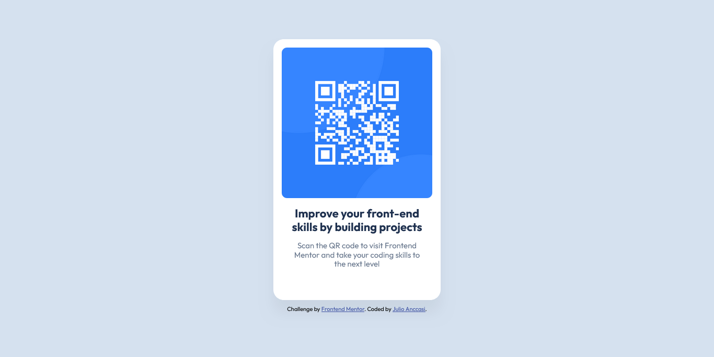

# Frontend Mentor - QR code component solution

This is a solution to the [QR code component challenge on Frontend Mentor](https://www.frontendmentor.io/challenges/qr-code-component-iux_sIO_H). Frontend Mentor challenges help you improve your coding skills by building realistic projects.

## Table of contents

- [Frontend Mentor - QR code component solution](#frontend-mentor---qr-code-component-solution)
  - [Table of contents](#table-of-contents)
  - [Overview](#overview)
    - [Screenshot](#screenshot)
    - [Links](#links)
  - [My process](#my-process)
    - [Built with](#built-with)
    - [What I learned](#what-i-learned)
    - [Continued development](#continued-development)
    - [Useful resources](#useful-resources)
  - [Author](#author)

**Note: Delete this note and update the table of contents based on what sections you keep.**

## Overview

### Screenshot




### Links

- Solution URL: [Solution](https://www.frontendmentor.io/solutions/qr-code-component-solution-Sk_KnLkysA)
- Live Site URL: [Live site](https://chechix.github.io/qr-code-component/)

## My process

### Built with

- Semantic HTML5 markup
- CSS custom properties
- Flexbox
- Mobile-first workflow

### What I learned

I want to highlight the part where I center the card with flexbox in the middle of the screen by stretching the body to achieve it.

```css
html,
body {
  height: 100%;
}

body {
  background-color: var(--slate-300);
  font-family: 'Outfit', sans-serif;
  display: flex;
  justify-content: center;
  align-items: center;
  flex-direction: column;
}
```

### Continued development

I want to continue learning about Flexbox and Grid to apply them in future projects.

### Useful resources

- [MDN Padding Documentation](https://developer.mozilla.org/en-US/docs/Web/CSS/Reference/Properties/padding) - This helped me because when I added padding, I didn't know where it was going.

## Author

- Frontend Mentor - [@ChechiX](https://www.frontendmentor.io/profile/ChechiX)
